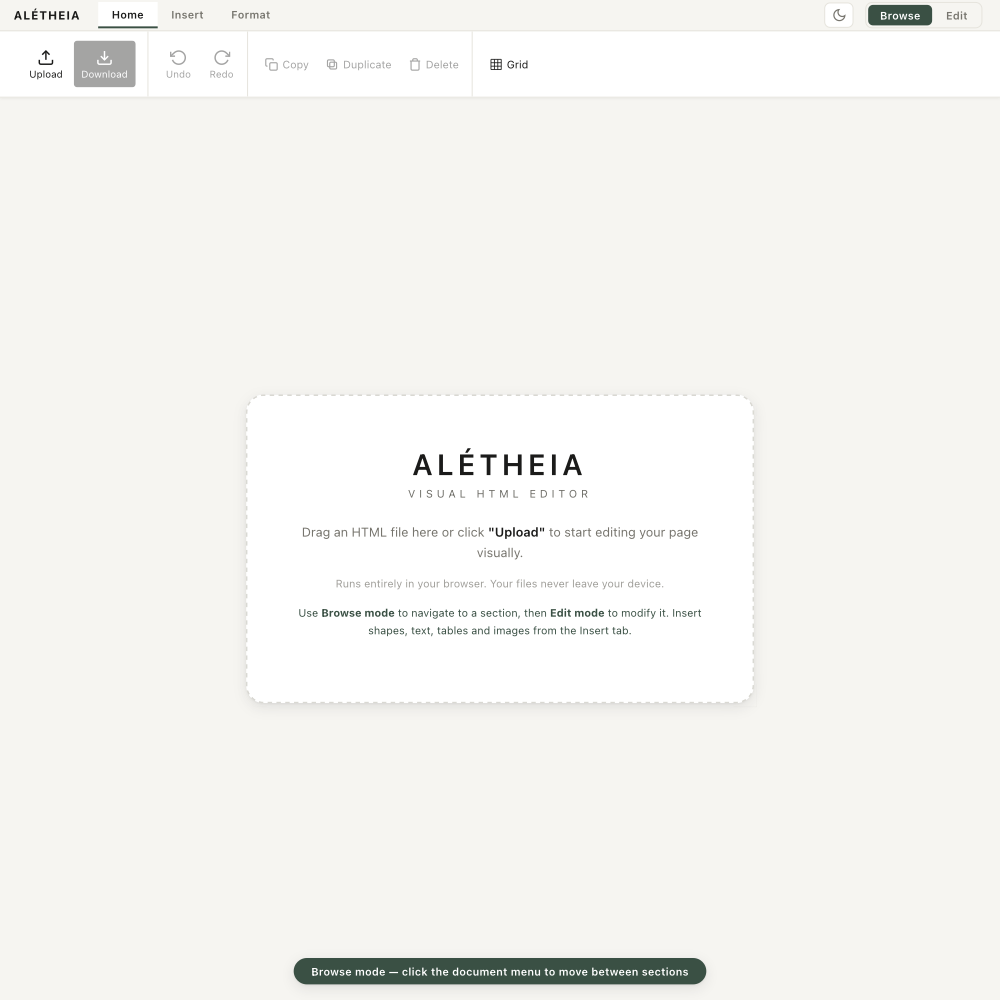
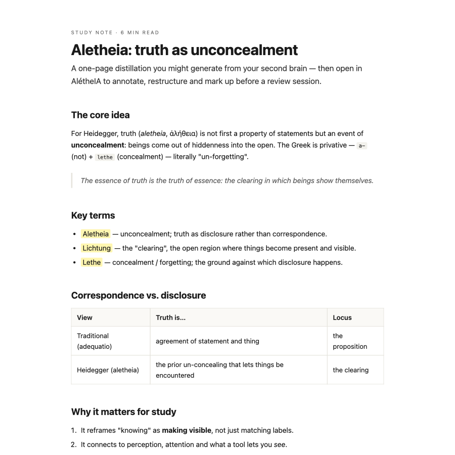

<h1 align="center">ALETHEIA</h1>
<p align="center"><strong>A visual HTML editor for study — edit your pages the way you use PowerPoint.</strong></p>
<p align="center">
  <em>Single file · runs offline in your browser · no build step, no dependencies, no data leaves your device.</em>
</p>

<p align="center">
  
</p>

---

## Why this exists

I build a lot of **HTML study documents** — notes, summaries, one-pagers — very often generated with an LLM. That part works well. The friction was always the **last mile**: once the page exists, I want to *fix a heading, move a box, circle a term, drop a star next to the key idea, jot a question in the margin* — and I did not want to drop back into a prompt → regenerate → re-download loop with an AI every single time I needed a small change.

In Tiago Forte's framing, a second brain runs on **CODE — Capture, Organise, Distil, Express.** LLMs are great at the first three and at the *first draft* of "Express". **ALETHEIA is the tool for the rest of Express:** taking that generated HTML and refining it by **direct manipulation** — selecting, moving, annotating — so the document becomes *mine* without another round-trip through a model.

> Truth, for Heidegger, is *aletheia* (ἀλήθεια) — **unconcealment**, bringing what is latent into the open. That is exactly what this tool does to an HTML file: it makes its structure visible and editable. The name folds that idea together with **IA** (AI).

## What it is

ALETHEIA opens any `.html` file and lets you edit it visually, like a slide:

- **Select, move, resize, rotate** any element — yours or the original page's.
- **Insert** text boxes, images, tables, coloured notes, links, and **21 study marks & icons** (check, X, star, question, idea, bookmark, pin, flag, search, clock, key, arrows, brackets…).
- **Annotate** freehand with a pencil, a highlighter, and an **area eraser** (three sizes) — the way you'd mark up a printout.
- **Take side notes** in a docked **Reflection** panel with Notion-style `/` blocks and **Markdown import/export**.
- **Download** the result as a clean, self-contained HTML file — your annotations and notes baked in.

It is **one HTML file**. There is no install, no account, no server. Everything runs locally; your documents never leave your machine (the only optional online feature is a bring-your-own-key AI helper for the notes panel).

<p align="center">
  
  <br><sub>A study one-pager (see <code>examples/</code>) — the kind of HTML you'd open, annotate and restructure.</sub>
</p>

## Features

| | |
|---|---|
| **Two modes** | *Browse* to read and navigate, *Edit* to manipulate. |
| **Direct manipulation** | drag, resize, rotate, multi-select, marquee. |
| **Study objects** | 21 outline marks/icons + text boxes, images, tables, sticky notes, links. |
| **In-place text** | double-click to edit; type a centred label inside any shape or note. |
| **Annotation** | pencil · highlighter · area eraser, each with its own pointer. |
| **Reflection panel** | `/` blocks (headings, to-dos, callouts, toggles, key terms…), Markdown in/out, optional AI. |
| **Proportional canvas** | opening the notes panel scales the page down — it never reflows. |
| **Multi-select format** | select several elements at once; all format actions apply to the whole selection. |
| **System paste** | Ctrl/⌘+V pastes images or text directly from the OS clipboard. |
| **Clean export** | downloaded as `<original-name>-editado.html`; editor UI stripped, content + notes kept. |
| **Keyboard-first** | full shortcut set; ⌘ on Mac, Ctrl elsewhere. |
| **Offline & private** | pure vanilla JS in a single file; files stay on your device. |

## Quick start

1. **Download** [`ALETHEIA.html`](ALETHEIA.html) (the whole app is this one file).
2. **Double-click it** — it opens in your default browser.
3. **Drag an HTML file** onto the drop zone (or click **Upload**). Try [`examples/study-note-example.html`](examples/study-note-example.html).
4. Switch to **Edit** (`Shift+E`), then select, annotate and edit. Press **Download** when done.

No internet connection is needed once the file has loaded.

## How it fits a second-brain workflow

```
   Capture → Organise → Distil → Express
                                    │
                    LLM drafts your study HTML
                                    │
                              ┌─────▼─────┐
                              │  ALETHEIA │  ← refine by hand: edit, annotate, restructure
                              └─────┬─────┘
                                    │
                         a study doc that's truly yours
```

Generate with whatever you like; **finish by hand, fast.**

## Documentation

- **[User Manual (DOCX)](docs/Manual_ALETHEIA_User_V0_EN.docx)** — step-by-step guide for everyday use.
- **[DEVELOPER.md](DEVELOPER.md)** — full architecture, subsystems, coordinate systems and invariants for anyone extending the editor.
- **[CHANGELOG.md](CHANGELOG.md)** — what changed across versions.

## Repository layout

```
ALETHEIA.html      ← the application (this single file is the whole app)
README.md          ← you are here
DEVELOPER.md       ← architecture & internals
CHANGELOG.md       ← version history
LICENSE            ← MIT
docs/              ← user manual + screenshots
examples/          ← a sample study HTML to open and try
```

## Privacy & tech

- **No dependencies, no build step.** Pure HTML + CSS + one IIFE of vanilla JavaScript.
- **Local only.** Your files are read in the browser and never uploaded. The optional AI helper is the single exception and uses your own API key, stored only in your browser.
- **Portable export.** The downloaded HTML is self-contained (annotations as inline SVG, images as data URIs).

## Contributing

This is a personal study tool, shared in case it's useful. Issues and PRs are welcome. If you extend it, read **DEVELOPER.md** first.

## License

[MIT](LICENSE) — do what you like; no warranty.

